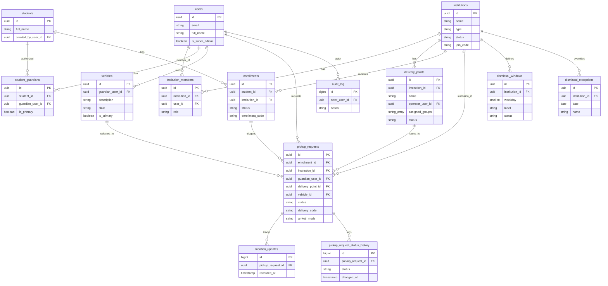

# Modelo de datos

> Documentación en español; **identificadores en inglés** (`snake_case` en base
> de datos). PostgreSQL + PostGIS.

## Visión general

Catorce entidades cubren el dominio. Los puntos clave que reflejan las decisiones:

- `institution` (no "school") soporta multi-institución por alumno.
- `student_guardian` permite varios tutores autorizados por alumno.
- `enrollment` modela la asociación alumno–institución **con aprobación**.
- `pickup_request` es el evento central (terna tutor–alumno–institución).
- `delivery_point` modela los puntos de entrega físicos dentro de una
  institución (ej. "Puerta principal", "Puerta vehicular"). La asignación de
  cada `pickup_request` a un punto es automática y por grupo/nivel, no
  elegible por el tutor — ver ADR-012.
- `dismissal_exception` sobreescribe puntualmente el horario de
  `dismissal_window` (ej. "Fin de cursos") — ver ADR-015.
- `pickup_request_status_history` registra cada transición de estado de un
  `pickup_request` — ver ADR-013.
- `vehicle` es la lista reutilizable de vehículos del tutor en su perfil;
  `pickup_request` guarda un snapshot denormalizado al momento del viaje —
  ver ADR-014.
- Campos geográficos con PostGIS (`geography(Point, 4326)`).

## Entidades

### `users`
Cuenta de autenticación para todos los roles.

| Campo | Tipo | Notas |
|---|---|---|
| `id` | uuid (PK) | |
| `email` | varchar | único |
| `password_hash` | varchar | nullable; Argon2. `NULL` mientras `status = invited` sin contraseña definida — ver ADR-022 |
| `full_name` | varchar | |
| `phone` | varchar | nullable |
| `status` | enum | `active`, `invited`, `suspended` |
| `is_super_admin` | boolean | operador de la plataforma |
| `notify_enrollment_approved` | boolean | default `true` — ver ADR-016 |
| `notify_dismissal_reminder` | boolean | default `true` — ver ADR-016 |
| `notify_delivery_confirmed` | boolean | default `true` — ver ADR-016 |
| `notify_product_news` | boolean | default `false` — ver ADR-016 |
| `created_at` / `updated_at` | timestamptz | |

> El rol dentro de una institución vive en `institution_members`; la condición de
> tutor se deriva de `student_guardians`.
>
> El "inicio con huella" del perfil es autenticación biométrica de dispositivo
> (WebAuthn/plataforma): vive del lado cliente y no tiene campo correspondiente
> en `users`. Ver ADR-016.

### `institutions`
Plantel: escuela o actividad extracurricular.

| Campo | Tipo | Notas |
|---|---|---|
| `id` | uuid (PK) | |
| `name` | varchar | |
| `type` | enum | `school`, `extracurricular` |
| `category` | varchar | nullable — subcategoría/disciplina cuando `type = extracurricular` (ej. "Ballet", "Natación", "Robótica"); siempre nulo para `type = school`. Ver ADR-015 |
| `address` | varchar | |
| `location` | geography(Point,4326) | punto de la institución |
| `geofence_radius_meters` | int | radio de **arribo**: detecta llegada a la institución (polígono = mejora futura). Distinto de `activation_radius_meters` — ver ADR-013 |
| `activation_radius_meters` | int | radio de **activación**: distancia a partir de la cual se habilita el botón "ya voy" en la app del padre. Coexiste con `geofence_radius_meters`, no lo sustituye — ver ADR-013 |
| `timezone` | varchar | para los horarios de salida |
| `cct_code` | varchar | nullable — clave de centro de trabajo (SEP). Ver ADR-015 |
| `levels` | varchar[] | niveles que ofrece la institución (ej. preescolar, primaria, secundaria). Ver ADR-015 |
| `arrival_tolerance_minutes` | int | tolerancia antes de marcar el plazo de recogida como vencido. Ver ADR-015 |
| `advance_notice_minutes` | int | minutos de anticipación para el recordatorio de salida. Ver ADR-015 |
| `join_code` | varchar | único — código que el tutor captura para vincular la institución (ej. "CSB-2024"). Ver ADR-015 |
| `status` | enum | `pending`, `approved`, `suspended` |
| `created_at` / `updated_at` | timestamptz | |

### `institution_members`
Relación usuario ↔ institución, con rol.

| Campo | Tipo | Notas |
|---|---|---|
| `id` | uuid (PK) | |
| `institution_id` | uuid (FK) | |
| `user_id` | uuid (FK) | |
| `role` | enum | `admin`, `gate_operator`, `coordinator`, `teacher` |
| `created_at` | timestamptz | |

Restricción: único `(institution_id, user_id)`.

> El acceso a la consola de puerta (Puerta - Consola de salida) está disponible
> para cualquier `institution_member` de la institución, independientemente de
> su `role`. El campo `role` es informativo/organizacional (reportes, directorio
> de personal) y base para reglas de permisos más finas en el futuro, pero no
> restringe hoy el acceso a esa pantalla específica. Ver ADR-011.

### `delivery_points`
Puntos de entrega dentro de una institución (ej. "Puerta principal", "Puerta
vehicular").

| Campo | Tipo | Notas |
|---|---|---|
| `id` | uuid (PK) | |
| `institution_id` | uuid (FK) | |
| `name` | varchar | |
| `description` | varchar | nullable (ej. "Av. Universidad · operador José Ramírez") |
| `operator_user_id` | uuid (FK) | nullable — miembro de la institución asignado |
| `assigned_groups` | varchar[] | nullable — grupos o niveles que llegan por este punto (ej. `["Preescolar"]` o `["3°B", "4°A"]`). Base para la asignación automática de `pickup_requests.delivery_point_id`. Ver ADR-012 |
| `status` | enum | `active`, `inactive` |
| `created_at` / `updated_at` | timestamptz | |

> La asignación alumno–punto de entrega es a nivel institucional/estructural
> (por grupo o nivel), no por padre individual. Al crear un `pickup_request`,
> se resuelve matcheando `enrollments.grade_or_group` contra
> `assigned_groups`. Un tutor no puede cambiar el punto de entrega de su
> recogida específica. Ver ADR-012.

### `students`

| Campo | Tipo | Notas |
|---|---|---|
| `id` | uuid (PK) | |
| `full_name` | varchar | |
| `birth_date` | date | nullable |
| `photo_url` | varchar | nullable |
| `created_by_user_id` | uuid (FK) | tutor que lo registró |
| `created_at` / `updated_at` | timestamptz | |

### `student_guardians`
Tutores autorizados por alumno (madre, padre, abuela, chofer).

| Campo | Tipo | Notas |
|---|---|---|
| `id` | uuid (PK) | |
| `student_id` | uuid (FK) | |
| `guardian_user_id` | uuid (FK) | |
| `relationship` | enum | `mother`, `father`, `grandparent`, `driver`, `other` |
| `is_primary` | boolean | tutor principal |
| `status` | enum | `active`, `invited`, `revoked` |
| `created_at` | timestamptz | |

Restricción: único `(student_id, guardian_user_id)`.

> `is_primary` se fuerza en base de datos con un índice único parcial
> (`UNIQUE INDEX ... ON student_guardians (student_id) WHERE is_primary =
> true`): solo un tutor por alumno puede ser el principal. Ver ADR-018.

### `vehicles`
Lista reutilizable de vehículos guardados en el perfil del tutor.

| Campo | Tipo | Notas |
|---|---|---|
| `id` | uuid (PK) | |
| `guardian_user_id` | uuid (FK) | dueño del vehículo |
| `description` | varchar | ej. "Mazda CX-5 gris" |
| `plate` | varchar | |
| `is_primary` | boolean | vehículo principal del tutor |
| `created_at` / `updated_at` | timestamptz | |

> `pickup_requests.vehicle_id` referencia esta tabla cuando el tutor selecciona
> un vehículo guardado; `pickup_requests.vehicle_description` y
> `vehicle_plate` guardan un snapshot de ese vehículo al momento del viaje (no
> cambian si el vehículo se edita o borra después). Ver ADR-014.
>
> `is_primary` se fuerza en base de datos con un índice único parcial
> (`UNIQUE INDEX ... ON vehicles (guardian_user_id) WHERE is_primary = true`):
> solo un vehículo por tutor puede ser el principal. Ver ADR-018.

### `enrollments`
Asociación alumno ↔ institución con aprobación.

| Campo | Tipo | Notas |
|---|---|---|
| `id` | uuid (PK) | |
| `student_id` | uuid (FK) | |
| `institution_id` | uuid (FK) | |
| `status` | enum | `pending`, `approved`, `rejected` |
| `grade_or_group` | varchar | nullable (contexto escolar). Base para asignar `pickup_requests.delivery_point_id` — ver ADR-012 |
| `enrollment_code` | varchar | único — folio/matrícula visible en UI (ej. "A-10428"). Ver ADR-016 |
| `requested_by_user_id` | uuid (FK) | tutor solicitante |
| `reviewed_by_user_id` | uuid (FK) | miembro de la institución, nullable |
| `requested_at` | timestamptz | |
| `reviewed_at` | timestamptz | nullable |

Restricción: único `(student_id, institution_id)`.

> `enrollment_code` vive en `enrollments`, no en `students`: la matrícula/folio
> es propia de la relación alumno–institución (un mismo alumno tiene folios
> distintos en su primaria y en su clase de taekwondo), no un dato del alumno
> en general. Ver ADR-016.

### `pickup_requests`
Evento central: "voy en camino".

| Campo | Tipo | Notas |
|---|---|---|
| `id` | uuid (PK) | |
| `enrollment_id` | uuid (FK) | vincula alumno + institución aprobada |
| `institution_id` | uuid (FK) | denormalizado desde `enrollment.institution_id` al crear el registro; inmutable después. Evita el join `pickup_request → enrollment → institution` en consultas del tablero y al resolver el topic MQTT. Ver ADR-018 |
| `guardian_user_id` | uuid (FK) | tutor que va en camino |
| `delivery_point_id` | uuid (FK) | nullable — punto de entrega asignado a este viaje. Resuelto automáticamente al crear el `pickup_request` matcheando `enrollments.grade_or_group` contra `delivery_points.assigned_groups`. Nullable para instituciones con un solo punto de entrega o cuando no hay match. Ver ADR-012 |
| `status` | enum | `en_route`, `arriving`, `arrived`, `delivered`, `cancelled` |
| `started_at` | timestamptz | |
| `estimated_arrival_at` | timestamptz | nullable |
| `eta_seconds` | int | nullable (último ETA calculado) |
| `last_location` | geography(Point,4326) | nullable (última posición) |
| `delivery_code` | varchar | código de 4 dígitos: el tutor lo muestra en su app, el staff lo verifica antes de entregar al alumno. Ver ADR-013 |
| `arrival_mode` | enum | `vehicle`, `walking` — nullable/opcional, ver nota. Ver ADR-013 |
| `vehicle_id` | uuid (FK) | nullable — vehículo guardado en el perfil del tutor (`vehicles`), si se seleccionó uno; nulo si camina o usa un vehículo no guardado. Ver ADR-014 |
| `vehicle_description` | varchar | nullable — snapshot del vehículo al momento del viaje (ver nota). Ver ADR-014 |
| `vehicle_plate` | varchar | nullable — snapshot del vehículo al momento del viaje (ver nota). Ver ADR-014 |
| `completed_at` | timestamptz | nullable |
| `created_at` / `updated_at` | timestamptz | |

> `arrival_mode`, `vehicle_description` y `vehicle_plate` son opcionales porque
> el modo de llegada varía **por viaje**, no es un dato fijo del tutor: algunos
> tutores llegan caminando. Ver ADR-013.
>
> **Snapshot vs. referencia.** `vehicle_id` es la referencia al vehículo
> guardado (si se usó uno); `vehicle_description` y `vehicle_plate` son un
> **snapshot denormalizado** de ese vehículo copiado al momento del viaje (o
> capturado libre si el tutor no seleccionó uno guardado). Es intencional: si
> el tutor edita o borra un vehículo de su perfil después, el histórico de
> `pickup_requests` no cambia retroactivamente. Ver ADR-014.

### `pickup_request_status_history`
Historial de transiciones de estado de un `pickup_request`. Se usa una tabla de
historial separada en lugar de timestamps individuales (`arriving_at`,
`arrived_at`, etc.) en `pickup_requests` — ver ADR-013.

| Campo | Tipo | Notas |
|---|---|---|
| `id` | bigserial (PK) | |
| `pickup_request_id` | uuid (FK) | |
| `status` | enum | mismo enum que `pickup_requests.status` |
| `changed_at` | timestamptz | |
| `changed_by_user_id` | uuid (FK) | nullable (null si la transición fue automática/del sistema) |

> Métricas derivadas (ej. "tiempo en puerta") se calculan restando timestamps
> consecutivos de esta tabla, no con campos ad-hoc en `pickup_requests`.

### `location_updates`
Histórico de telemetría (alto volumen).

| Campo | Tipo | Notas |
|---|---|---|
| `id` | bigserial (PK) | |
| `pickup_request_id` | uuid (FK) | |
| `location` | geography(Point,4326) | |
| `accuracy_meters` | float | nullable |
| `recorded_at` | timestamptz | |

> Retención de 90 días desde `pickup_requests.completed_at`, luego purga vía
> job programado. Ver ADR-018.

### `dismissal_windows`
Horarios de salida por institución.

| Campo | Tipo | Notas |
|---|---|---|
| `id` | uuid (PK) | |
| `institution_id` | uuid (FK) | |
| `weekday` | smallint | 0–6 |
| `start_time` | time | |
| `end_time` | time | |
| `label` | varchar | ej. "Salida vespertina". Ver ADR-015 |
| `level` | varchar | nullable — nivel al que aplica (ej. "Primaria · Secundaria"). Ver ADR-015 |
| `status` | enum | `active`, `paused`. Ver ADR-015 |

### `dismissal_exceptions`
Días especiales que sobreescriben el horario normal de `dismissal_windows` (ej.
"Fin de cursos"). Ver ADR-015.

| Campo | Tipo | Notas |
|---|---|---|
| `id` | uuid (PK) | |
| `institution_id` | uuid (FK) | |
| `date` | date | |
| `name` | varchar | ej. "Fin de cursos" |
| `level` | varchar | nullable — nivel afectado, o "todos los niveles" |
| `time` | time | hora de salida especial |
| `created_at` | timestamptz | |

Restricción: único `(institution_id, date, level)`. Ver ADR-018.

### `audit_log`
Trazabilidad de acciones sensibles.

| Campo | Tipo | Notas |
|---|---|---|
| `id` | bigserial (PK) | |
| `actor_user_id` | uuid (FK) | nullable |
| `action` | varchar | p. ej. `enrollment.approved`, `guardian.added` |
| `entity_type` | varchar | |
| `entity_id` | varchar | |
| `metadata` | jsonb | nullable |
| `created_at` | timestamptz | |

## Ciclo de vida de `pickup_request`

```
en_route ──> arriving ──> arrived ──> delivered
   │             │            │
   └─────────────┴────────────┴──> cancelled
```

- `en_route`: el tutor inició el trayecto; se publica ubicación y se calcula ETA.
- `arriving`: el ETA es bajo o entró a la geocerca.
- `arrived`: en Camino A, el tutor confirma "ya llegué" (sin geofence en
  background); el staff lo ve en el tablero.
- `delivered`: el staff confirma la entrega del alumno.
- `cancelled`: el tutor cancela en cualquier momento.

Cada transición se registra como una fila en `pickup_request_status_history`
(estado, momento, y quién la originó). No hay timestamps individuales por
estado en `pickup_requests`; métricas como "tiempo en puerta" se derivan
restando `changed_at` entre filas consecutivas del historial.

## Diagrama entidad-relación


