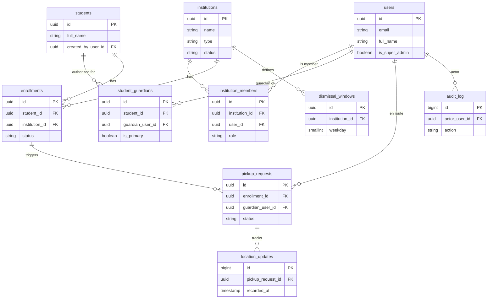

# Modelo de datos

> Documentación en español; **identificadores en inglés** (`snake_case` en base
> de datos). PostgreSQL + PostGIS.

## Visión general

Diez entidades cubren el dominio. Los puntos clave que reflejan las decisiones:

- `institution` (no "school") soporta multi-institución por alumno.
- `student_guardian` permite varios tutores autorizados por alumno.
- `enrollment` modela la asociación alumno–institución **con aprobación**.
- `pickup_request` es el evento central (terna tutor–alumno–institución).
- Campos geográficos con PostGIS (`geography(Point, 4326)`).

## Entidades

### `users`
Cuenta de autenticación para todos los roles.

| Campo | Tipo | Notas |
|---|---|---|
| `id` | uuid (PK) | |
| `email` | varchar | único |
| `password_hash` | varchar | Argon2 |
| `full_name` | varchar | |
| `phone` | varchar | nullable |
| `status` | enum | `active`, `invited`, `suspended` |
| `is_super_admin` | boolean | operador de la plataforma |
| `created_at` / `updated_at` | timestamptz | |

> El rol dentro de una institución vive en `institution_members`; la condición de
> tutor se deriva de `student_guardians`.

### `institutions`
Plantel: escuela o actividad extracurricular.

| Campo | Tipo | Notas |
|---|---|---|
| `id` | uuid (PK) | |
| `name` | varchar | |
| `type` | enum | `school`, `extracurricular` |
| `address` | varchar | |
| `location` | geography(Point,4326) | punto de la institución |
| `geofence_radius_meters` | int | radio de arribo (polígono = mejora futura) |
| `timezone` | varchar | para los horarios de salida |
| `status` | enum | `pending`, `approved`, `suspended` |
| `created_at` / `updated_at` | timestamptz | |

### `institution_members`
Relación usuario ↔ institución, con rol.

| Campo | Tipo | Notas |
|---|---|---|
| `id` | uuid (PK) | |
| `institution_id` | uuid (FK) | |
| `user_id` | uuid (FK) | |
| `role` | enum | `admin`, `staff` |
| `created_at` | timestamptz | |

Restricción: único `(institution_id, user_id)`.

### `students`

| Campo | Tipo | Notas |
|---|---|---|
| `id` | uuid (PK) | |
| `full_name` | varchar | |
| `birth_date` | date | nullable |
| `photo_url` | varchar | nullable |
| `created_by_user_id` | uuid (FK) | tutor que lo registró |
| `created_at` / `updated_at` | timestamptz | |

### `student_guardians`
Tutores autorizados por alumno (madre, padre, abuela, chofer).

| Campo | Tipo | Notas |
|---|---|---|
| `id` | uuid (PK) | |
| `student_id` | uuid (FK) | |
| `guardian_user_id` | uuid (FK) | |
| `relationship` | enum | `mother`, `father`, `grandparent`, `driver`, `other` |
| `is_primary` | boolean | tutor principal |
| `status` | enum | `active`, `invited`, `revoked` |
| `created_at` | timestamptz | |

Restricción: único `(student_id, guardian_user_id)`.

### `enrollments`
Asociación alumno ↔ institución con aprobación.

| Campo | Tipo | Notas |
|---|---|---|
| `id` | uuid (PK) | |
| `student_id` | uuid (FK) | |
| `institution_id` | uuid (FK) | |
| `status` | enum | `pending`, `approved`, `rejected` |
| `grade_or_group` | varchar | nullable (contexto escolar) |
| `requested_by_user_id` | uuid (FK) | tutor solicitante |
| `reviewed_by_user_id` | uuid (FK) | miembro de la institución, nullable |
| `requested_at` | timestamptz | |
| `reviewed_at` | timestamptz | nullable |

Restricción: único `(student_id, institution_id)`.

### `pickup_requests`
Evento central: "voy en camino".

| Campo | Tipo | Notas |
|---|---|---|
| `id` | uuid (PK) | |
| `enrollment_id` | uuid (FK) | vincula alumno + institución aprobada |
| `guardian_user_id` | uuid (FK) | tutor que va en camino |
| `status` | enum | `en_route`, `arriving`, `arrived`, `delivered`, `cancelled` |
| `started_at` | timestamptz | |
| `estimated_arrival_at` | timestamptz | nullable |
| `eta_seconds` | int | nullable (último ETA calculado) |
| `last_location` | geography(Point,4326) | nullable (última posición) |
| `completed_at` | timestamptz | nullable |
| `created_at` / `updated_at` | timestamptz | |

### `location_updates`
Histórico de telemetría (alto volumen).

| Campo | Tipo | Notas |
|---|---|---|
| `id` | bigserial (PK) | |
| `pickup_request_id` | uuid (FK) | |
| `location` | geography(Point,4326) | |
| `accuracy_meters` | float | nullable |
| `recorded_at` | timestamptz | |

> Definir política de retención / downsampling: no conservar la traza indefinida
> (privacidad + volumen).

### `dismissal_windows`
Horarios de salida por institución.

| Campo | Tipo | Notas |
|---|---|---|
| `id` | uuid (PK) | |
| `institution_id` | uuid (FK) | |
| `weekday` | smallint | 0–6 |
| `start_time` | time | |
| `end_time` | time | |

### `audit_log`
Trazabilidad de acciones sensibles.

| Campo | Tipo | Notas |
|---|---|---|
| `id` | bigserial (PK) | |
| `actor_user_id` | uuid (FK) | nullable |
| `action` | varchar | p. ej. `enrollment.approved`, `guardian.added` |
| `entity_type` | varchar | |
| `entity_id` | varchar | |
| `metadata` | jsonb | nullable |
| `created_at` | timestamptz | |

## Ciclo de vida de `pickup_request`

```
en_route ──> arriving ──> arrived ──> delivered
   │             │            │
   └─────────────┴────────────┴──> cancelled
```

- `en_route`: el tutor inició el trayecto; se publica ubicación y se calcula ETA.
- `arriving`: el ETA es bajo o entró a la geocerca.
- `arrived`: en Camino A, el tutor confirma "ya llegué" (sin geofence en
  background); el staff lo ve en el tablero.
- `delivered`: el staff confirma la entrega del alumno.
- `cancelled`: el tutor cancela en cualquier momento.

## Diagrama entidad-relación


